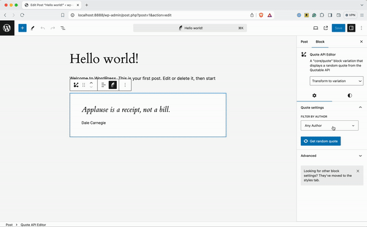
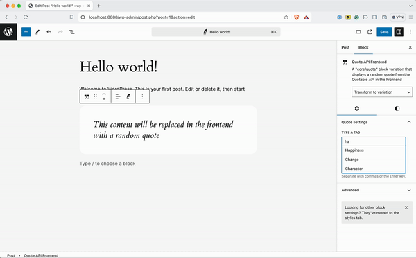
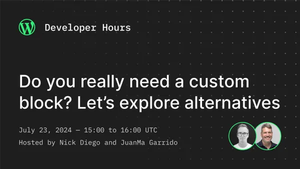

# Developer Hours - Alternatives to Custom Blocks

   

> ![!IMPORTANT]
> This project is a child theme of Twenty Twenty Four that showcase different ways of extending a core block. 

This child theme registers Block Styles and Variations of `core/quote` block and leverage Block Bindings to customize the dynamic render of the inner paragraph for one of its variations.

The following two Block Variations are registered in this child theme:
- `Quote API Editor` - extends `core/quote` to allow it to fill it with a random quote from an API (optionally filtered by author) in the editor

- `API Quote Frontend` - extends `core/quote` by connecting its inner paragraph to a custom binding source that outputs a random quote (optionally filtered by tags) in the frontend

---

This project has been prepared for the event [Developer Hours: Do you really need a custom block? Let’s explore alternatives](https://www.meetup.com/es-ES/learn-wordpress-online-workshops/events/301860423/?notificationId=1397062753762701312) that was held on July 23rd 2024

Resources mentioned on the Developer Hours session are available at this [Google Doc](https://docs.google.com/document/d/1myYoEehSPS6rhFMzpEq4h_v3z5Z4TTA_C1rJDG0Mk0U/edit)

## Development

This child-theme requires that [`twenty-twenty-four`](https://github.com/WordPress/WordPress/tree/master/wp-content/themes/twentytwentyfour) theme also exists in the `themes` folder.

1. Set up a local WordPress development environment.
2. Clone / download this repository into the `wp-content/themes` folder.
3. Navigate to the `wp-content/themes/tt4-dh-alternatives-custom-blocks` folder in the command line.
4. Run `npm install` to install the plugin's dependencies within a `/node_modules/` folder.
5. Run `npm run start` to compile and watch source files for changes while developing.

Refer to `package.json` for additional commands.